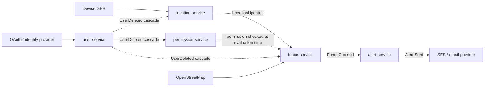

# Architecture Overview

**Status:** living document — reflects the current plan, not a finished system. Updated as decisions land in [`docs/adr/`](../adr/README.md).

## Bounded contexts → services (proposed)

The Event Storming session identified five aggregates, each a natural bounded context. The default plan is one microservice per aggregate; a context only splits further if it grows a distinct sub-domain.

| Aggregate | Service | Responsibility |
|-----------|---------|-----------------|
| User | `user-service` | Account lifecycle: registration, email verification, login, password change, deletion |
| Permission | `permission-service` | The consent relationship: request, grant, deny, revoke, expire |
| Location | `location-service` | Current position and periodic location reporting |
| Fence | `fence-service` | Geofence definition and crossing detection |
| Alert | `alert-service` | Delivery of notifications to watchers |

## Event flow (the reactive spine)

Full domain narrative, aggregates, and business decision records: [`docs/domain/event-storming-summary.md`](../domain/event-storming-summary.md).

## Cross-cutting concerns — not yet decided

These are the advanced patterns the project intends to exercise; each will get its own ADR once evaluated rather than being decided upfront:

- **Event sourcing store** per aggregate — Kafka log directly vs. a dedicated store (e.g. Marten, EventStoreDB) with Kafka for cross-service propagation.
- **CQRS read models** — `fence-service` needs a fast, eventually-consistent read model of permissions to re-check them on every `LocationUpdated` without calling `permission-service` synchronously on the hot path.
- **Saga / process manager** for the `User Deleted` fan-out cascade (must be reliable and idempotent across three services).
- **API gateway / BFF** in front of the services for the mobile client.
- **Service-to-service auth** (likely mTLS or a service mesh, depending on the Kubernetes decision).
- **Observability** — distributed tracing across the Location → Fence → Alert spine.
- **Cloud / IaC target** — Azure-leaning, Terraform vs. Kubernetes/Helm still under evaluation (SES stays on AWS regardless, per the event storming domain edges).

## Related docs

- Domain model & business decisions: [`docs/domain/event-storming-summary.md`](../domain/event-storming-summary.md)
- Decision log: [`docs/adr/README.md`](../adr/README.md)
