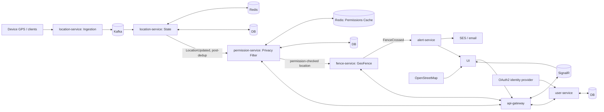

# Architecture Overview

**Status:** living document — reflects the current plan, not a finished system. Updated as decisions land in [`docs/adr/`](../adr/README.md).

## Bounded contexts → services

The Event Storming session identified five aggregates, each a natural bounded context. Confirmed through the data-flow diagram below: one microservice per aggregate, with `location-service` further split internally (see Bounded-context notes).

| Aggregate | Service | Responsibility |
|-----------|---------|-----------------|
| User | `user-service` | Account lifecycle: registration, email verification, login, password change, deletion |
| Permission | `permission-service` | The consent relationship: request, grant, deny, revoke, expire |
| Location | `location-service` | Current position and periodic location reporting |
| Fence | `fence-service` | Geofence definition and crossing detection |
| Alert | `alert-service` | Delivery of notifications to watchers |

## Event flow (the reactive spine)

Settled through three rounds of whiteboarding the actual data flow (not just the aggregate map):

The key property this design enforces (per BDR-002): permission is re-checked on *every* location update, in one place (`permission-service`'s Privacy Filter), before that update reaches `fence-service` — not just when serving reads. `location-service` rejects ~90% of raw pings that carry no positional change before anything downstream ever sees them.

Full domain narrative, aggregates, and business decision records: [`docs/domain/event-storming-summary.md`](../domain/event-storming-summary.md).

## Bounded-context notes

- **`location-service`** is internally split into an `Ingestion` component (absorbs raw GPS pings, publishes to Kafka) and a `State` component (dedup/current-position cache + history `DB`) — one bounded context, two deployable pieces.
- **`permission-service`** owns its own `DB`, separate from `user-service`'s — User and Permission stayed two aggregates with two stores, per the original event-storming split, not merged.
- Database engines are deliberately left generic (`DB`) for `location-service`, `permission-service`, and `user-service` — not yet decided. `fence-service` and `alert-service` use MongoDB per [ADR-0004](../adr/0004-mongodb-hand-rolled-event-sourcing.md); for `alert-service` that store holds the per-attempt delivery event log (retries, channel outcomes) described in [BDR-005](../domain/event-storming-summary.md#bdr-005-alert-aggregate-models-delivery-as-a-retryable-multi-channel-history).

## Known simplifications in the diagram (revisit before/at implementation)

- The `User Deleted` cascade (BDR-004) isn't represented in this data-flow diagram; it's a lifecycle concern tracked separately, not dropped.

## Cross-cutting concerns — not yet decided

These are the advanced patterns the project intends to exercise; each will get its own ADR once evaluated rather than being decided upfront:

- **CQRS read models** — beyond the Permissions Cache already in the diagram, whether `fence-service` needs its own materialized read model of fence definitions vs. querying on demand.
- **Saga / process manager** for the `User Deleted` fan-out cascade (must be reliable and idempotent across three services).
- **API gateway implementation** — the diagram fixes its existence and role, not the tool (candidate: YARP).
- **Service-to-service auth** (likely mTLS or a service mesh, depending on the Kubernetes decision).
- **Observability** — distributed tracing across the Location → Permission → Fence → Alert spine.
- **Cloud / IaC target** — Azure-leaning, Terraform vs. Kubernetes/Helm still under evaluation (SES stays on AWS regardless, per the event storming domain edges).

## Related docs

- Domain model & business decisions: [`docs/domain/event-storming-summary.md`](../domain/event-storming-summary.md)
- Decision log: [`docs/adr/README.md`](../adr/README.md)
